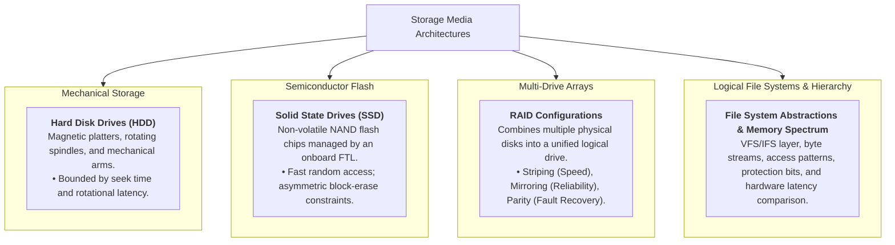

> [!abstract] Overview
> **Storage & IO Systems** manage non-volatile persistent media, bridging the speed gap between high-speed CPU registers/RAM and slow secondary storage. The operating system hides physical hardware complexities (such as spinning magnetic platters, mechanical seeks, and NAND flash erase blocks) behind standardized abstractions like the **Logical Block Interface** and byte-oriented **File Systems**.

---

## Module Notes

- [[File Systems & Storage Technologies|File Systems & Storage Technologies]]
- [[Hard Disk Drive Mechanics & Scheduling|Hard Disk Drive Mechanics & Scheduling]]
- [[Solid State Drives & NAND Flash|Solid State Drives & NAND Flash]]
- [[RAID Architectures|RAID Architectures]]

---

## Physical Storage & Abstraction Hierarchy

---

## Related Modules

- [[Computer Systems/Operating Systems/Memory Management/index|Memory Management Subsystem]]
- [[Interrupts and Exceptions|Interrupts and Exceptions]]
- [[Computer Systems/Operating Systems/index|Operating Systems Main Directory]]