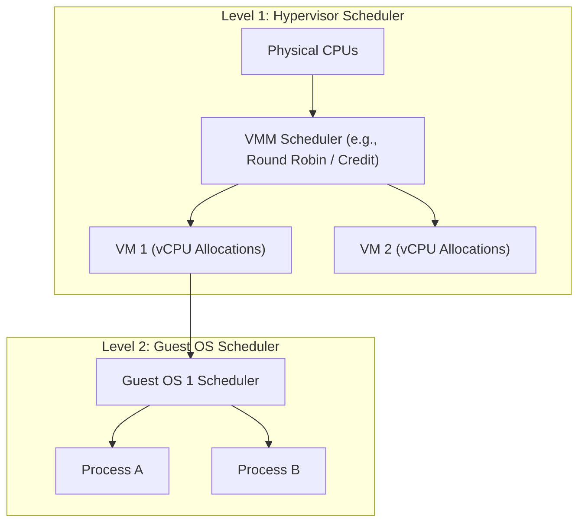
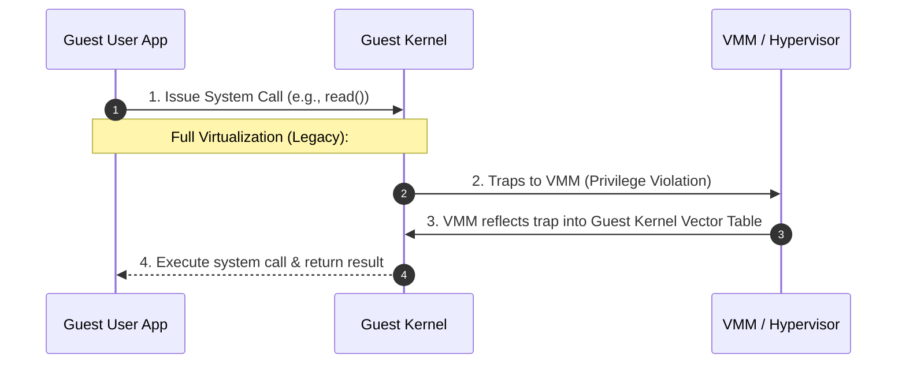
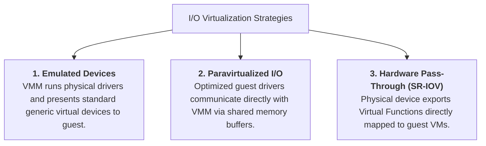

> [!abstract] Abstract
> To present a complete physical hardware illusion, a Virtual Machine Monitor (VMM) must virtualize execution cores (**vCPUs**), system events (**Interrupts & Exceptions**), and external **I/O Devices**. The hypervisor multiplexes virtual CPUs via multi-level scheduling, vectors hardware events directly to guest instances, and mediates storage and network access through emulated drivers, paravirtualized I/O, or hardware pass-through (**SR-IOV**).

---

## Virtualizing the CPU & vCPU Scheduling

The hypervisor manages physical processor cores by abstracting them as **Virtual CPUs (vCPUs)** assigned to guest VMs.

![[Pasted image 20260803225945.png]]

### Two-Level Scheduling Model
Virtual CPU execution relies on a nested, two-tier scheduling hierarchy:

1.  **VMM Scheduling (Level 1):** The hypervisor schedules vCPUs onto physical CPU cores using time-slicing algorithms (e.g., Round Robin or proportional credit schedulers).
2.  **Guest OS Scheduling (Level 2):** During its assigned vCPU time quantum, the guest OS schedules its internal user threads and processes.

---

## Virtualizing System Events: Interrupts & Exceptions

The VMM must intercept and deliver hardware interrupts, fault exceptions, and system calls to the target virtual machine without exposing host hardware state.

![[Pasted image 20260803225653.png]]

### Event Delivery Paradigms
*   **Full Virtualization (Software Trap):** Hardware events trap directly to the VMM. The VMM inspects the cause, updates virtual CPU control registers, and injects the exception into the guest OS vector table.
*   **Paravirtualization:** The VMM places event notifications into a shared memory **Event Queue**, which the guest OS processes via hypercalls.
*   **Hardware-Assisted Virtualization:** Modern CPU architectures (Intel VT-x / AMD-V) deliver virtualized interrupts directly into the guest OS execution context without requiring hypervisor intervention.

---

### System Call Execution Workflow

When a process inside a guest VM issues a system call (e.g., `read()`):

![[Pasted image 20260803225742.png]]

In modern hardware-assisted CPUs executing in **Non-Root Mode**, system calls generated within Ring 3 trap directly to the Guest OS in Ring 0 without triggering a heavy hypervisor exit (`VM-Exit`).

---

## Virtualizing I/O Devices

Because the spectrum of physical expansion cards and peripheral devices is vast, hypervisors employ three distinct strategies to virtualize I/O devices:

![[Pasted image 20260803231635.png]]

### 1. Emulated Virtual Devices
*   The VMM exports standardized software-emulated hardware devices (e.g., an IDE disk controller or Intel e1000 NIC).
*   **Pros:** High compatibility; default drivers included with any guest OS work out-of-the-box.
*   **Cons:** Poor throughput; every single I/O register access triggers a hypervisor trap and emulation routine.

### 2. Paravirtualized I/O (e.g., `virtio`)
*   Uses specialized virtual drivers inside the guest kernel designed to communicate directly with hypervisor ring buffers (`virtqueue`).
*   **Pros:** Bypasses legacy hardware register emulation, reducing CPU overhead and maximizing throughput.

### 3. Hardware-Accelerated I/O (SR-IOV & IOMMU)
*   **Single Root I/O Virtualization (SR-IOV):** Physical PCIe hardware devices export multiple **Virtual Functions (VF)** that can be mapped directly into guest address spaces.
*   **IOMMU:** Translates Guest Physical Addresses (GPA) directly to Host Physical Addresses (HPA) for Direct Memory Access (DMA) transfers, achieving near-native wire speeds.

---

## Related Notes

- [[Hypervisor Architectures & Software Virtualization|Hypervisor Architectures & Software Virtualization]]
- [[Memory Virtualization & Extended Page Tables|Memory Virtualization & Extended Page Tables]]
- [[Classic Scheduling Algorithms|Classic Scheduling Algorithms]]
- [[Computer Systems/Operating Systems/Virtual Machines/index|Virtual Machines Main Directory]]