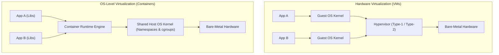
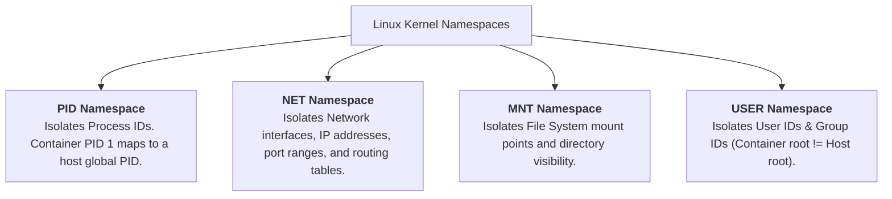
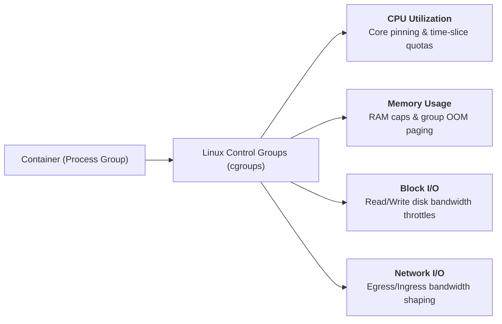

> [!abstract] Abstract
> Unlike hardware hypervisors that emulate physical hardware for guest operating systems, **Containers** implement **OS-Level Virtualization**. Containers group processes together into an isolated environment that feels like a dedicated operating system. By leveraging kernel **Namespaces** to isolate system object naming and **Control Groups (cgroups)** to enforce resource limits, containers provide lightweight, high-performance virtualization sharing a single host kernel.

---

## Hardware Virtualization vs. OS-Level Virtualization

Hypervisors virtualize physical hardware, requiring each Virtual Machine (VM) to run its own complete guest operating system kernel. In contrast, containers virtualize **operating system abstractions**, allowing multiple isolated process environments to run concurrently on a shared host kernel.

![[Pasted image 20260803233459.png]]

![[Pasted image 20260803234145.png]]

### Architectural Trade-off Summary

| Attribute | Hardware Virtualization (VMs) | OS-Level Virtualization (Containers) |
|---|---|---|
| **Virtualization Boundary** | Hardware ISA (CPU, Memory, Devices) | Operating System Abstractions (APIs, System Calls) |
| **Kernel State** | Dedicated Guest Kernel per VM | Single Shared Host OS Kernel |
| **Startup / Boot Time** | Seconds to minutes (Full OS boot) | Sub-second (Process creation) |
| **Resource Overhead** | Heavy (Gigabytes RAM, full OS image) | Lightweight (Megabytes RAM, shared OS binaries) |
| **Isolation Barrier** | Hardware-enforced (Ring 0 vs Non-Root) | OS Kernel boundary (Namespaces & cgroups) |

---

## Namespace Isolation

A **Namespace** restricts what system objects a group of processes can see. Containers achieve isolation by creating dedicated namespaces for key kernel resources.

> [!tip] The Naming Isolation Principle
> **"If a process cannot name an object, it cannot access or affect it."**
> Just as [[Virtual Memory & Address Translation Fundamentals|Virtual Memory Page Tables]] isolate process address spaces by restricting accessible physical addresses, namespaces isolate processes by restricting accessible system object identifiers.

### Implementation Mechanics
1. **Object Tagging:** The kernel tags every system object with the namespace identifier to which it belongs.
2. **Global-to-Local ID Mapping:** The kernel tracks all processes on global data structures, mapping container-local IDs to global host PIDs:
   * *Example:* A process running inside a container sees itself as `PID 1` within its local PID namespace, while the host kernel tracks it globally as `PID 10452`.
3. **Visibility Filtering:** System calls like `ps` query the kernel within the calling process's namespace context, filtering out all processes tagged under different namespaces.

---

## Resource Management via Control Groups (`cgroups`)

While namespaces isolate **what a process can see**, **Control Groups (cgroups)** limit **how much a process can consume**.

### Default Process Granularity vs. Container Group Management
* **Standard OS Behavior:** The kernel schedules and manages resources independently for each individual process.
* **Container Behavior (`cgroups`):** The kernel aggregates a tree of related processes into a logical control group, enforcing resource limits collectively across the entire set:
  * **CPU Allocation:** Restricts which physical CPU cores a container can execute on and caps total CPU quota per time period.
  * **Memory Limits:** Sets maximum RAM thresholds; if the combined memory usage of a container group exceeds its limit, the kernel triggers group-level paging or the OOM (Out-of-Memory) killer.
  * **Disk & Network I/O:** Limits read/write throughput (IOPS) to prevent noisy neighbor containers from saturating disk or network channels.

---

## Related Notes

- [[Virtualization Fundamentals & Trap-and-Emulate|Virtualization Fundamentals & Trap-and-Emulate]]
- [[Hypervisor Architectures & Software Virtualization|Hypervisor Architectures & Software Virtualization]]
- [[Process Abstraction & PCB|Process Abstraction & PCB]]
- [[Virtual Memory & Address Translation Fundamentals|Virtual Memory & Address Translation Fundamentals]]
- [[Computer Systems/Operating Systems/Virtual Machines/index|Virtual Machines Main Directory]]