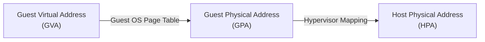
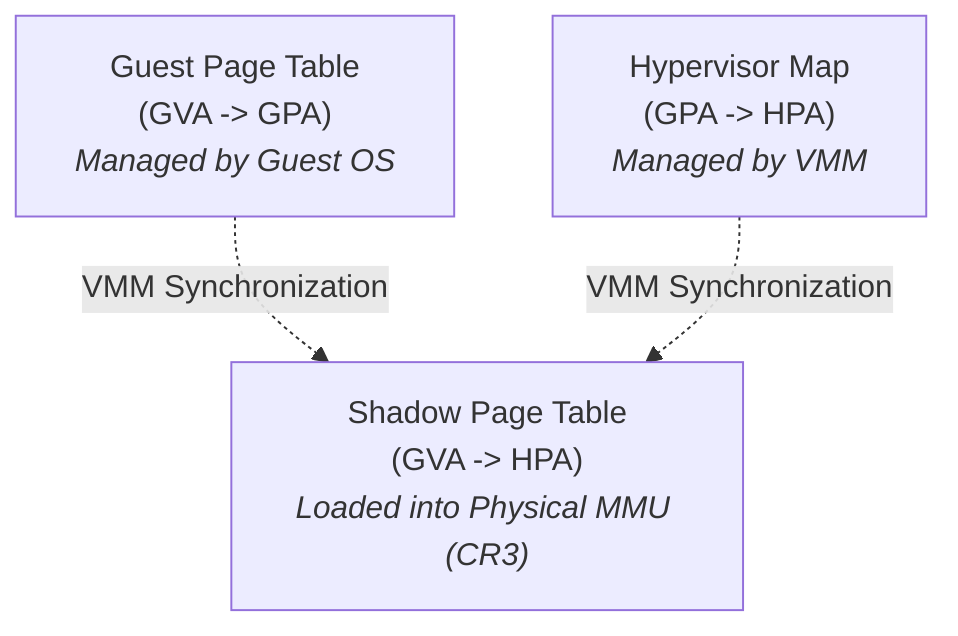
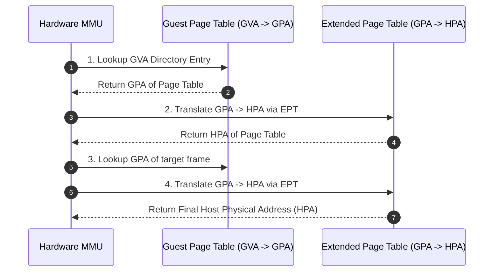

> [!abstract] Abstract
> Memory virtualization introduces a three-tiered address mapping abstraction: **Guest Virtual Address (GVA)** $\to$ **Guest Physical Address (GPA)** $\to$ **Host Physical Address (HPA)**. To ensure that hardware MMUs read physical DRAM locations directly, hypervisors originally maintained software **Shadow Page Tables**. Modern CPUs automate this translation using hardware **Extended Page Tables (EPT)** / **Nested Page Tables (NPT)**, performing two-dimensional page walks in hardware.

---

## Three-Tiered Address Abstraction

In a virtualized system, physical DRAM is controlled exclusively by the hypervisor. This requires decoupling the guest OS's view of physical memory from real host RAM frames:

![[Pasted image 20260803230026.png]]

1.  **Guest Virtual Address (GVA):** The virtual address space allocated to application processes running inside the guest VM.
2.  **Guest Physical Address (GPA):** The contiguous memory space presented to the guest OS as its physical RAM.
3.  **Host Physical Address (HPA):** The actual hardware DRAM address signal generated on the host memory bus.

---

## Software Memory Virtualization: Shadow Page Tables

Because physical MMU hardware can only translate a single address mapping layer directly, early VMMs maintained software **Shadow Page Tables** that map **GVA directly to HPA**:

![[Pasted image 20260803231257.png]]

### Synchronization & Trap Mechanics
1.  The hardware MMU control register (`CR3`) is pointed directly to the **Shadow Page Table** (GVA $\to$ HPA).
2.  The VMM marks all memory pages containing **Guest OS Page Tables** as **Read-Only**.
3.  When the guest OS attempts to allocate memory or modify its page tables, the write operation triggers a page fault trap to the VMM.
4.  The VMM intercepts the fault, updates the Guest Page Table, computes the HPA mapping, updates the Shadow Page Table, and resumes guest execution.

> [!warning] Performance Overhead
> Software Shadow Page Tables incur massive trap overhead because every single page table write or context switch inside a guest VM forces a costly hypervisor exit (`VM-Exit`).

---

## Hardware-Assisted Memory Virtualization: EPT / NPT

Modern processors (Intel VT-x **Extended Page Tables (EPT)** and AMD-V **Nested Page Tables (NPT)**) virtualize address translation directly inside the hardware MMU.

![[Pasted image 20260803232023.png]]

### Hardware 2D Page Table Walk

With EPT enabled, the hardware MMU performs a two-dimensional nested page table walk in hardware:

![[Pasted image 20260803230236.png]]

### Benefits & Trade-offs
*   **Eliminates Hypervisor Traps:** Guest page table updates execute natively without triggering software traps to the VMM.
*   **Memory Lookups:** Increases hardware page table walk latency on TLB misses (up to 20+ hardware memory reads for a 2D walk), which is mitigated by large hardware **TLB Caches**.

---

## Hardware Virtualization Support Overview

Modern server CPUs combine multiple hardware virtualization primitives:

| Subsystem | Hardware Technology | Functional Responsibility |
|---|---|---|
| **CPU Modes** | Intel VT-x / AMD-V | Adds VMX Root (Host) and Non-Root (Guest) execution modes. |
| **Memory** | Intel EPT / AMD NPT | Hardware 2D nested page table walks (GPA $\to$ HPA). |
| **I/O Translation** | Intel VT-d / AMD-Vi (IOMMU) | Direct Memory Access (DMA) translation for guest VMs. |
| **I/O Device** | SR-IOV | Physical PCIe hardware device partitioning into Virtual Functions. |

---

## Related Notes

- [[Hypervisor Architectures & Software Virtualization|Hypervisor Architectures & Software Virtualization]]
- [[CPU, Event, and IO Virtualization|CPU, Event, and IO Virtualization]]
- [[Multi-Level Page Tables|Multi-Level Page Tables]]
- [[Translation Lookaside Buffer (TLB)|Translation Lookaside Buffer (TLB)]]
- [[Computer Systems/Operating Systems/Virtual Machines/index|Virtual Machines Main Directory]]