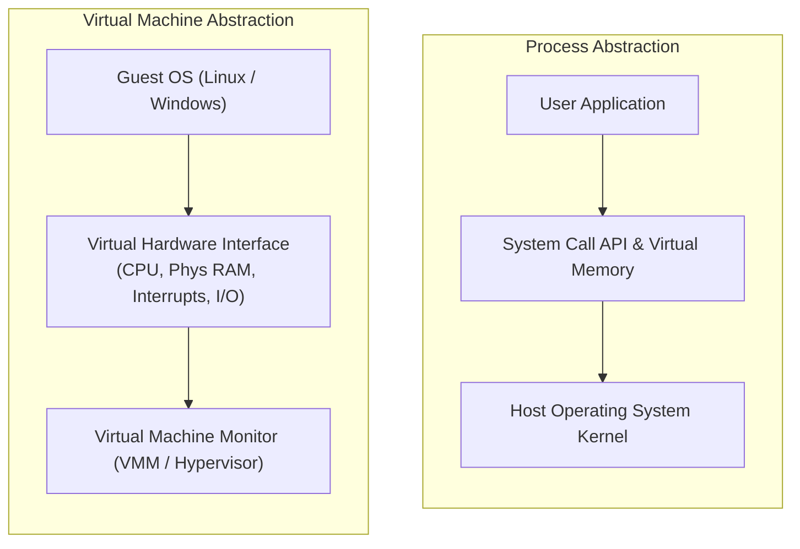
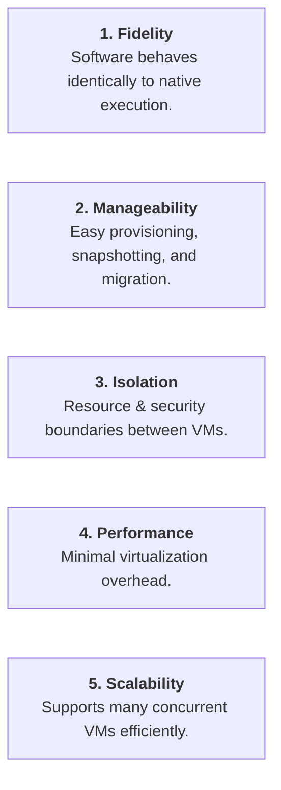
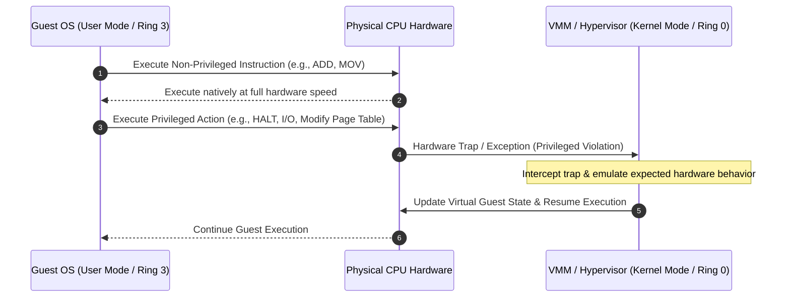

> [!abstract] Abstract
> **Virtualization** decouples operating systems and applications from physical hardware. A **Virtual Machine Monitor (VMM)** or **Hypervisor** virtualizes the underlying physical machine, presenting a complete hardware interface to guest operating systems. By running non-privileged instructions natively and trapping privileged actions (**Trap-and-Emulate**), VMMs deliver near-native performance while guaranteeing strict isolation and manageability.

---

## Process Abstraction vs. Virtual Machine Abstraction

Operating systems provide abstractions at different system boundaries depending on whether the target subject is an individual application or an entire operating system:

| Feature / Abstraction | Process Abstraction | Virtual Machine Abstraction |
|---|---|---|
| **Primary Target** | Single User Application | Entire Guest Operating System |
| **Memory View** | Private Virtual Address Space | Complete Physical Memory Architecture |
| **Interface API** | System Calls (`read`, `fork`, `exec`) | Full Instruction Set Architecture (ISA) & Hardware I/O |
| **Register Access** | General-Purpose / User Registers | All ISA Registers (including Supervisor/Control) |
| **Hardware Devices** | Abstracted via OS abstractions (files/sockets) | Direct Virtualized Devices (Virtual NIC, Disk, Interrupts) |

![[Pasted image 20260802214754.png]]

---

## Virtual Machine Monitor (VMM / Hypervisor)

A **Virtual Machine Monitor (VMM)**, also known as a **Hypervisor**, is a software or firmware layer that virtualizes physical hardware assets and arbitrates access among multiple guest virtual machines.

![[Pasted image 20260802215416.png]]

![[Pasted image 20260802215439.png]]

### Key Responsibilities
*   **Hardware Interface Presentation:** Presents the illusion of dedicated physical hardware to each guest OS.
*   **Resource Allocation & Multiplexing:** Dynamically distributes CPU cycles, physical RAM frames, and I/O bandwidth across active VMs.
*   **Inter-VM Isolation:** Prevents bugs, crashes, or security compromises in one VM from affecting neighboring VMs or the host hardware.

### Key Motivations & Use Cases
*   **Software & OS Compatibility:** Runs software compiled for different OS environments (e.g., running Linux binaries alongside Windows on a single host).
*   **Development & Testing:** Enables safe testing of unverified kernel modifications or multi-platform application code.
*   **Security Isolation:** Enforces hard boundaries; compromised guest instances remain sandboxed within their virtual environment.
*   **Cost & Resource Efficiency:** Consolidates multiple physical server workloads onto a single machine and enables live VM migration across physical host pools in cloud infrastructure.

---

## Core Design Goals of Virtualization

Architecting an effective hypervisor requires balancing five fundamental properties:

---

## Virtualization Execution Paradigms

### 1. Virtualization via Full Simulation (Emulation)
The VMM interprets every guest instruction in software, simulating CPU registers, memory access, and device I/O.
*   **Advantage:** Highly flexible; allows running guest software compiled for a completely different target architecture (e.g., ARM on x86).
*   **Disadvantage:** Severe performance penalty (orders of magnitude slower than native execution).

---

### 2. The VMM Approach: Trap-and-Emulate
To achieve native execution speed, modern hypervisors run guest instructions directly on the physical CPU, intervening only when the guest attempts privileged operations:

![[Pasted image 20260802220244.png]]

*   **VMM Mode:** Operates in physical **Kernel Mode (Supervisor / Ring 0)** with full hardware control.
*   **Guest OS Mode:** Deprivileged to execute in **User Mode (Ring 3)**.

#### Execution Workflow
1.  **Non-Privileged Instructions:** Execute directly on the physical CPU at full hardware speed without VMM intervention.
2.  **Privileged Actions:** When the guest OS attempts a privileged operation (e.g., issuing disk I/O, modifying control registers, halting the CPU), the CPU triggers a hardware trap to the VMM.
3.  **Emulation & Resume:** The VMM intercepts the trap, emulates the intended hardware behavior safely, updates the virtual guest state, and resumes guest execution.

#### Example: Handling the `HALT` Instruction
When an idle guest OS issues a `HALT` instruction to sleep the CPU:

![[Pasted image 20260802220337.png]]

1.  Executing `HALT` in deprivileged User Mode causes a hardware privilege exception trap.
2.  The trap transfers control directly to the VMM.
3.  The VMM catches the exception, emulates the behavior of the `HALT` instruction, and returns the expected state back to the Guest OS.

---

## Related Notes

- [[Hypervisor Architectures & Software Virtualization|Hypervisor Architectures & Software Virtualization]]
- [[CPU, Event, and IO Virtualization|CPU, Event, and IO Virtualization]]
- [[Memory Virtualization & Extended Page Tables|Memory Virtualization & Extended Page Tables]]
- [[Dual-Mode Operation & Memory Protection|Dual-Mode Operation & Memory Protection]]
- [[Computer Systems/Operating Systems/Virtual Machines/index|Virtual Machines Main Directory]]