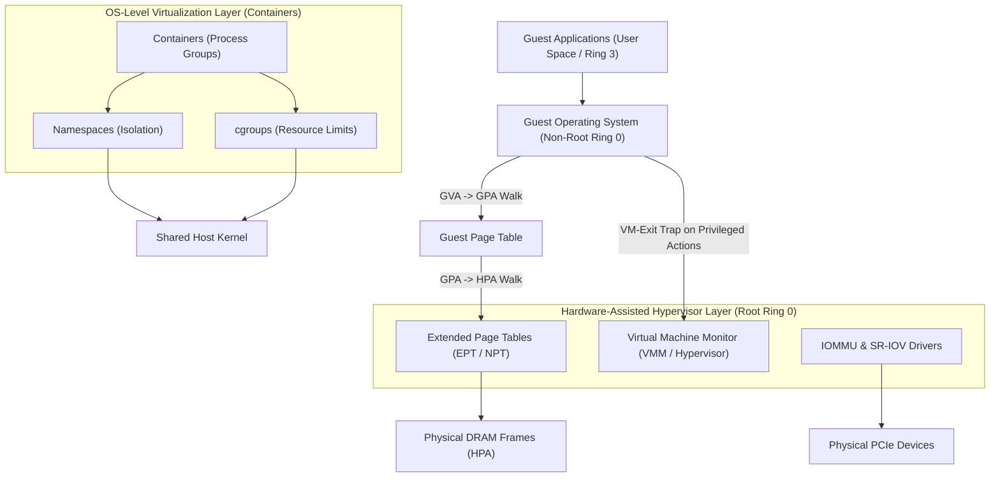

> [!abstract] Overview
> The **Virtual Machines** module covers system-level virtualization abstractions that decouple operating systems and process environments from physical hardware. It details Virtual Machine Monitor (VMM / Hypervisor) architectures, execution paradigms (Trap-and-Emulate), software translation techniques (Paravirtualization and Binary Translation), vCPU scheduling, event vectoring, I/O virtualization (SR-IOV), hardware-assisted memory translation (EPT / NPT), and OS-level container virtualization (Namespaces & cgroups).

---

## Module Notes

| Note Link                                                                                                                                         | Description                                                                                                                                           | Key Concepts                                                           |
| ------------------------------------------------------------------------------------------------------------------------------------------------- | ----------------------------------------------------------------------------------------------------------------------------------------------------- | ---------------------------------------------------------------------- |
| **[[Virtualization Fundamentals & Trap-and-Emulate\|Virtualization Fundamentals & Trap-and-Emulate]]**         | Process vs VM abstractions, VMM responsibilities, hypervisor design goals, full simulation vs. Trap-and-Emulate execution workflows.                  | Process vs VM, VMM, Hypervisor Goals, Trap-and-Emulate, HALT Handling  |
| **[[Hypervisor Architectures & Software Virtualization\|Hypervisor Architectures & Software Virtualization]]** | Structural classification of Type-1 bare-metal vs Type-2 hosted hypervisors, x86 virtualization pitfalls, Paravirtualization, and Binary Translation. | Type-1, Type-2, Popek-Goldberg, Paravirtualization, Binary Translation |
| **[[CPU, Event, and IO Virtualization\|CPU, Event, and IO Virtualization]]**                                   | Virtual core scheduling (vCPUs), event/interrupt vectoring, system call execution, and I/O virtualization via emulated drivers, virtio, and SR-IOV.   | vCPU Scheduling, System Call Traps, Emulated I/O, `virtio`, SR-IOV     |
| **[[Memory Virtualization & Extended Page Tables\|Memory Virtualization & Extended Page Tables]]**             | Three-tier memory mapping (GVA $\to$ GPA $\to$ HPA), software Shadow Page Tables, and hardware-assisted Extended Page Tables (EPT / NPT).             | GVA/GPA/HPA, Shadow Page Tables, Intel EPT, AMD NPT, IOMMU             |
| **[[Containers]]**                                                                                                                                | OS-level virtualization, container vs. VM architectural comparisons, namespace isolation (PID, Network, Mount), and resource control via cgroups.     | OS Virtualization, Namespaces, Local-to-Global PID Mapping, cgroups    |

---

## Virtualization Architecture Overview

---

## Related Modules

- [[Computer Systems/Operating Systems/Kernel & Architecture/index|Kernel & Architecture]]
- [[Computer Systems/Operating Systems/Memory Management/index|Memory Management]]
- [[Computer Systems/Operating Systems/Storage & IO Systems/index|Storage & IO Systems]]
- [[Computer Systems/Operating Systems/index|Operating Systems Main Directory]]