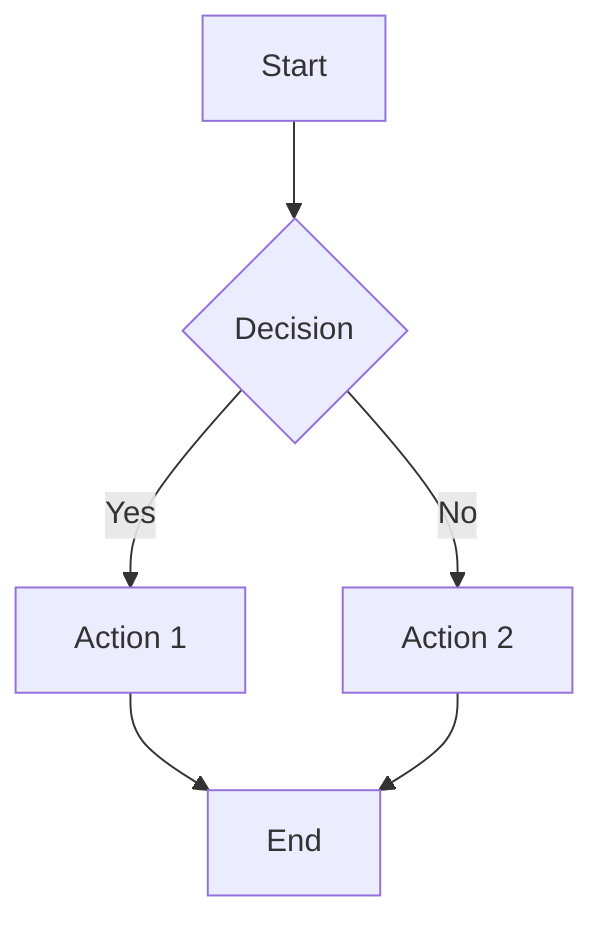

# Extended Markdown Syntax Examples

This document demonstrates the extended markdown syntax features available in your Quartz site.

## Tables

| Feature | Status | Description |
|---------|--------|-------------|
| Tables | ✅ | GitHub Flavored Markdown tables |
| Math | ✅ | LaTeX math rendering |
| Code | ✅ | Syntax highlighting |
| Citations | ✅ | Academic citations |

## Math Support (LaTeX)

Inline math: $E = mc^2$

Block math:
$$
\int_{-\infty}^{\infty} e^{-x^2} dx = \sqrt{\pi}
$$

## Code Blocks with Syntax Highlighting

```python
def fibonacci(n):
    """Calculate the nth Fibonacci number."""
    if n <= 1:
        return n
    return fibonacci(n-1) + fibonacci(n-2)

# Example usage
print(fibonacci(10))  # Output: 55
```

```javascript
// JavaScript example
const quickSort = (arr) => {
    if (arr.length <= 1) return arr;
    
    const pivot = arr[arr.length - 1];
    const left = arr.filter(x => x < pivot);
    const right = arr.filter(x => x > pivot);
    
    return [...quickSort(left), pivot, ...quickSort(right)];
};
```

## Task Lists

- [x] Enable GitHub Flavored Markdown
- [x] Add syntax highlighting
- [x] Configure LaTeX support
- [ ] Add more examples
- [ ] Test all features

## Callouts and Alerts

> [!NOTE]
> This is a note callout with important information.

> [!WARNING]
> This is a warning about something important.

> [!TIP]
> This is a helpful tip for users.

## Strikethrough and Emphasis

~~This text is struck through~~

**Bold text** and *italic text* and ***bold italic text***

## Superscript and Subscript

- Superscript: x^2^ + y^2^ = z^2^
- Chemical formula: H~2~O and CO~2~
- Scientific notation: 6.022 × 10^23^
- Mathematical expressions: a^n^ = a~1~ × a~2~ × ... × a~n~

## Links and References

- [[leetcode/index|Leetcode Problems]] - Internal wiki-style links
- [External Link](https://github.com) - Regular markdown links
- <https://example.com> - Auto-linked URLs

## Footnotes

Here's a sentence with a footnote[^1].

Another reference[^note].

[^1]: This is the first footnote.
[^note]: This is a named footnote.

## Hard Line Breaks

This line ends with two spaces  
And continues on the next line
Without needing an empty line between them.

## Mermaid Diagrams



## Extended Character Support

Emojis: 🚀 💻 📚 ✨

Special characters: → ← ↑ ↓ ✓ ✗ ±

## Keyboard Shortcuts

Press <kbd>Ctrl</kbd> + <kbd>C</kbd> to copy.

Use <kbd>⌘</kbd> + <kbd>V</kbd> on Mac to paste.
